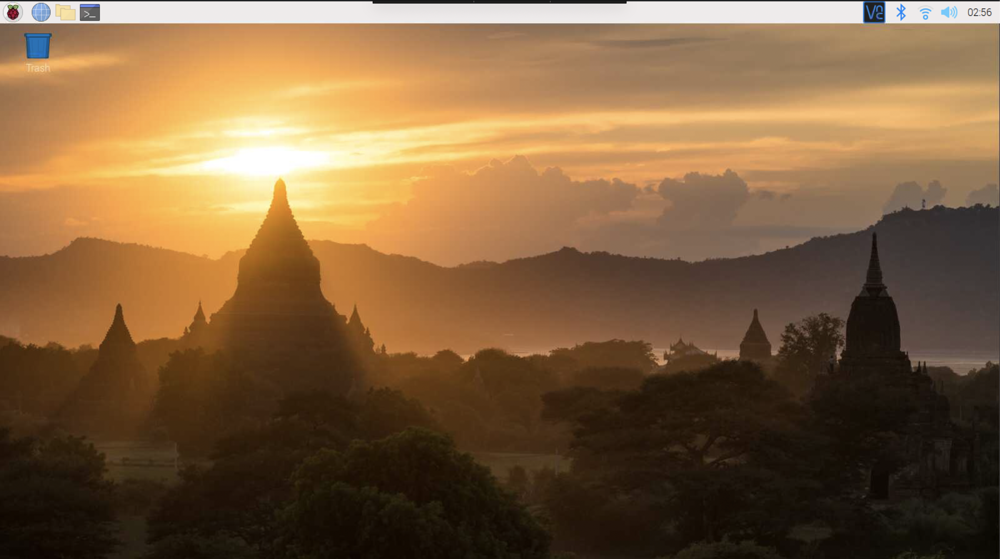
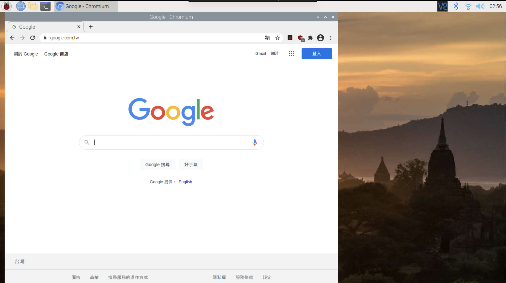

# 作業

## 作業1

* 觀察 Raspberry PI OS。桌面與純文字版本映像檔案的檔案大小，實際下載之後解壓縮，紀錄實際下載與解壓縮的時間。
* Ans: 
	* 下載網址 <https://www.raspberrypi.org/software/operating-systems/>
	* 桌機版 (2021-03-04-raspios-buster-armhf.img)：zip 大小為 1.23G，解壓縮後為 3.97G
	* 文字版 (2021-03-04-raspios-buster-armhf-lite.img)：zip 大小為 463.4MB，解壓縮後為 1.87G

## 作業2

* Raspberry PI OS 開機後會自動的將sdcard的硬碟空間擴展成 SDCard。所有的區域，觀察開機的過程，確定可以順利的開機並且使用內定的帳號 pi，密碼 raspberry 登入系統。
* Ans: 

## 作業3

* 練習設定 pi 無線網路，確定 pi 的網路可以穩定的連線至無線基地台，順利的取得無線基地台發送的 ip 與網路設定，並且啟動瀏覽器順利上網。
* Ans: 
